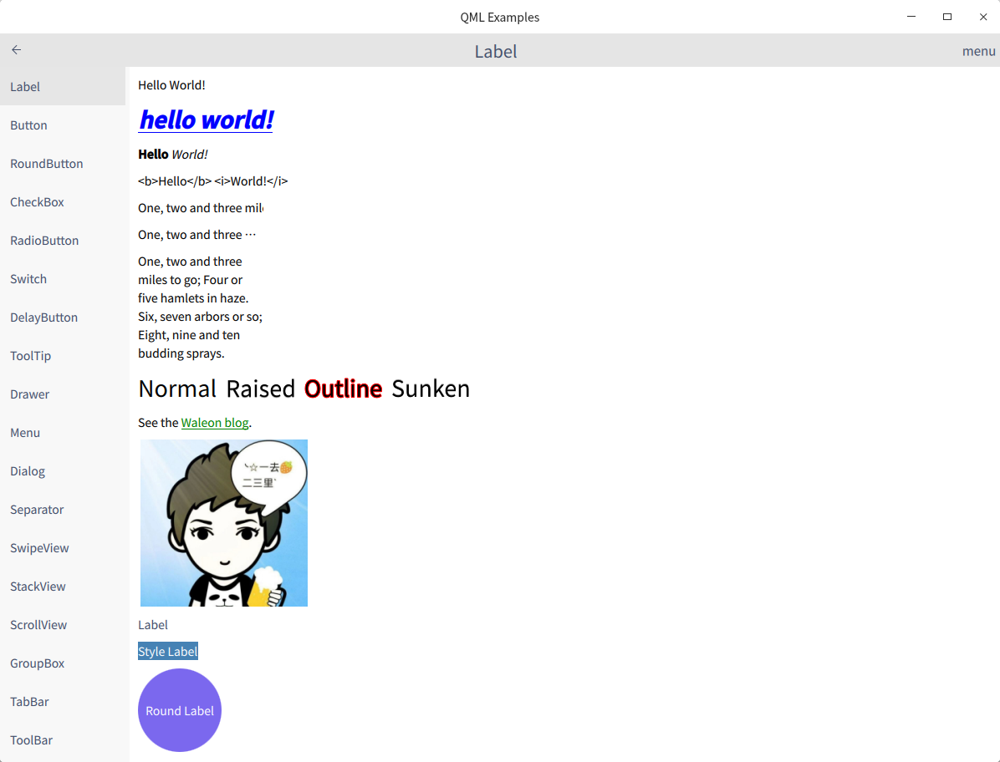

# QML Examples

Qt Quick 中的一系列控件示例

QML 相关内容见：[细说 QML](https://waleon.blog.csdn.net/category_9267924.html)

# 关于作者

作者：[一去、二三里](https://waleon.blog.csdn.net/)，爱编程、爱学习、爱生活！

- [个人博客](https://waleon.blog.csdn.net/)
- 个人微信：iwaleon（加我微信，邀请入 500 人微信群）
- 个人 QQ：550755606
- QQ 技术交流群：242790253

更多干货，请扫码关注我的微信公众号，不要太惊喜哦~

